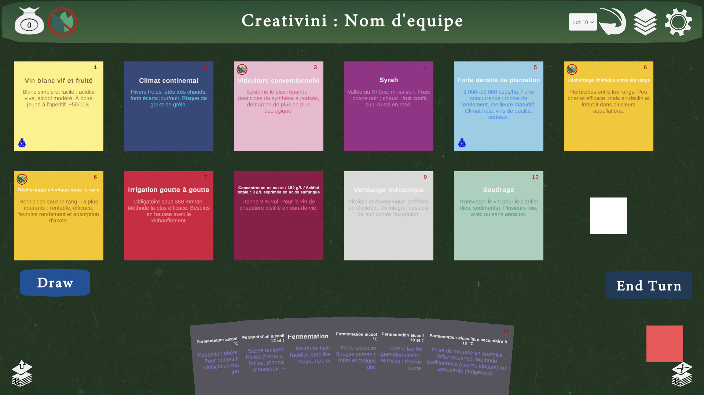
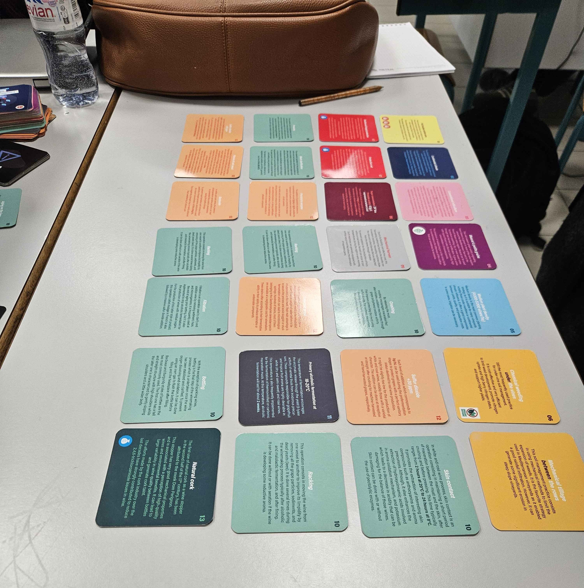
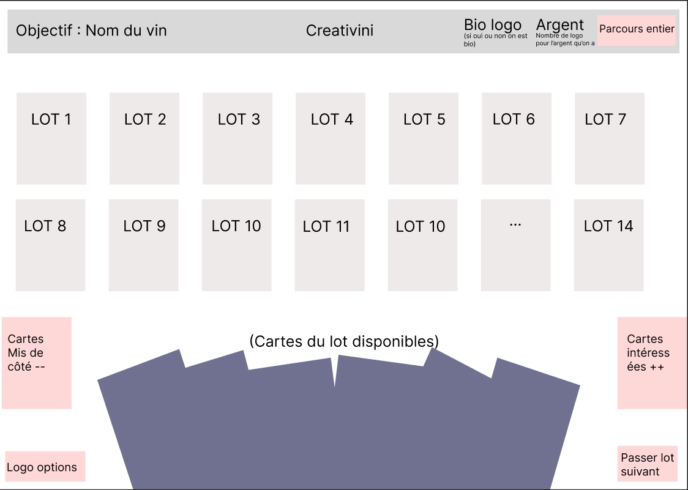
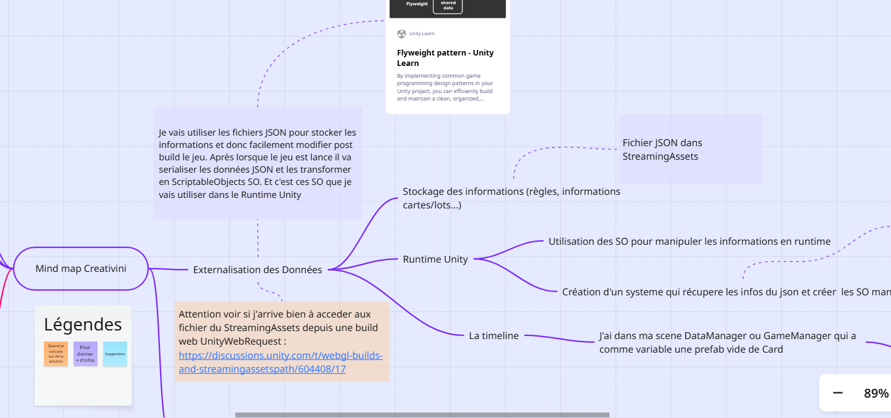

**Créativini** is a serious card game created by the École d'Ingénieurs de Purpan in 2022 to teach students how to build a technical itinerary for wine production. During my final Master's internship, I was in charge of turning it into a digital version in Unity, as part of the European **VINNEA** project (Interreg POCTEFA), which aims to develop innovative digital tools for training in the wine sector.  

The physical game is played by one to six players and contains 145 cards split into 14 batches, each batch matching a key step of the production cycle. Players discover and place cards to build a coherent itinerary, and the game relies a lot on discussion between participants. The goal was to stay faithful to this experience while taking advantage of what a digital version can bring.

I worked on the project for six months as the **only developer**, from analysis to development and the first tests with teachers. I started by attending real games played by students, then wrote a specification with the game's creator, Olivier Geffroy, and designed a UI mockup to define the scope before writing any code. Tasks were tracked on a Trello board, and I used a Miro diagram to map every game system beforehand, which helped avoid spaghetti code with more than 140 cards to handle.

**Adapting the gameplay.** Some batches contain more than twenty cards, so I designed a system where each player draws the same ten cards from a batch and can discard the ones they do not want to draw new ones. Everyone can browse the cards on their own screen without disturbing the others, while the placement of cards in the itinerary stays shared.

**Data externalisation.** All card data lives in JSON files, separated from the translation files for French, English and Spanish. Cards and batches can be added or edited without touching any C# code, which matters for a game meant to keep growing after my internship.

**Local multiplayer.** The most complex part of the project was the multiplayer over a shared local network, built with **Unity Netcode for GameObjects**. I relied on NetworkBehaviours and RPCs, and set up a turn-based system where the host acts as the authoritative server to avoid desynchronisation. I also limited network traffic to what is strictly necessary, for example by sending the ID of a played card instead of its full content.

Due to time constraints, disconnections are not handled yet, and there is no way to resume a game in progress.

A technical documentation is being written so that the next intern of the Master's program can take over the project. The next steps are online multiplayer, accessibility options, a supervisor role that lets teachers follow and guide games, and a final polish.

This internship was my first long professional experience on a game engine. I discovered multiplayer development on Unity, faced scalability and architecture problems I had never met in class, and learned to lead a project on my own while collecting direct feedback from the teachers and students who will actually use the game.

Demo link: <a href="https://youtu.be/ZWCFZ5n-ECM">Créativini demo</a>