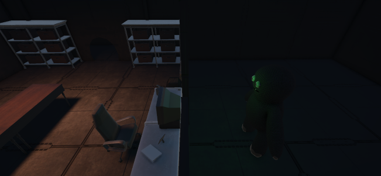
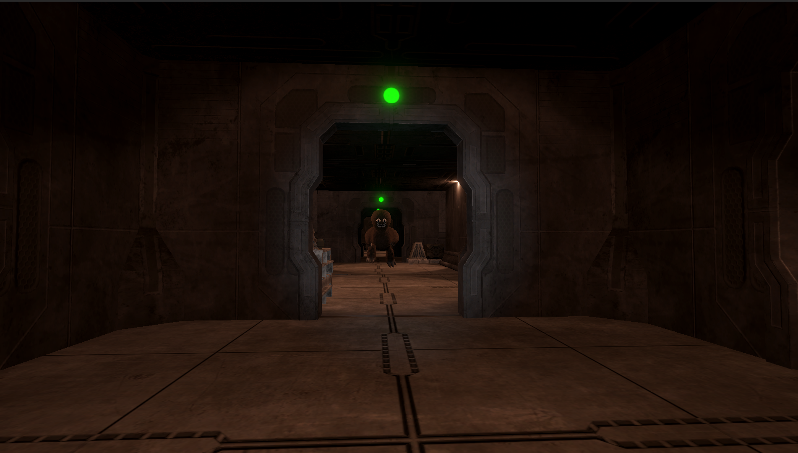
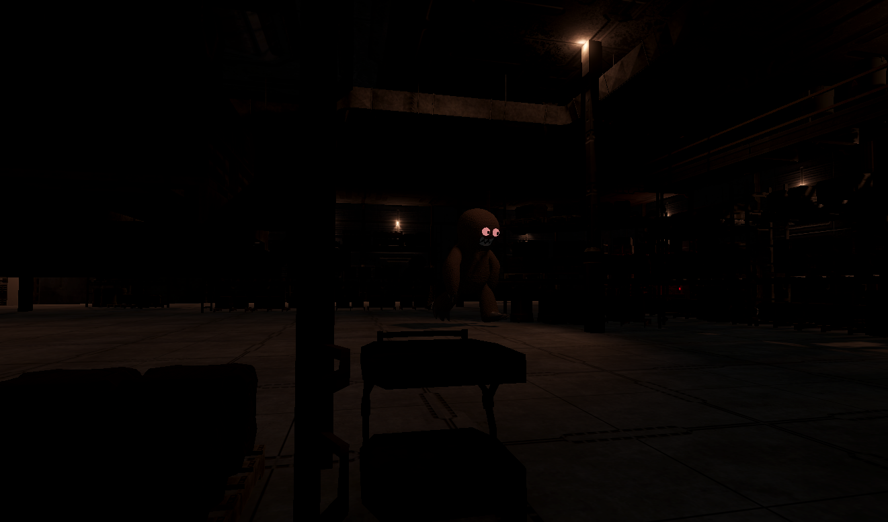

**Echoes of the Dolls** is a 3D horror prototype created in Unity 6 as a university project.  
The concept was inspired by the exaggerated mobile ads of “Beat the Puppet” games but with a twist: the doll escapes and turns against the player in a dark environment.

Developed over one month by a team of eight (including three programmers), the project mixed several short gameplay sequences : torture / chase / hide and seek.

As **developer**, I was in charge of the **first gameplay phase**, where the player interacts with a fully ragdoll-controlled doll using different weapons.  
This required building a clean, object-oriented weapon system and experimenting with Unity’s physics to make interactions feel reactive and chaotic in a fun way.

Through this project, I learned how to integrate ragdoll systems, structure clean modular code, and collaborate with multiple developers and artists using Git outside of class hours.  
Although the final chase sequence suffered from time constraints and bugs, the project was well received by the jury.

Link: <a href="https://www.youtube.com/watch?v=6ZDrD4WmJgY">Echoes of the Dolls Trailer</a>

