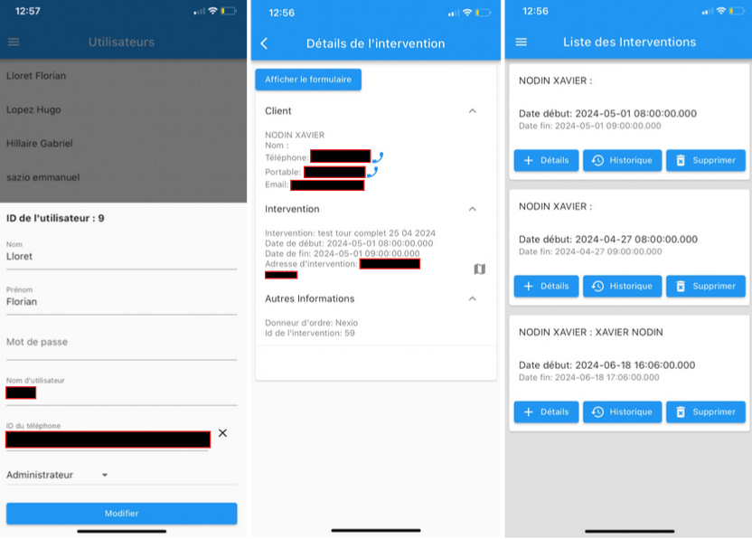
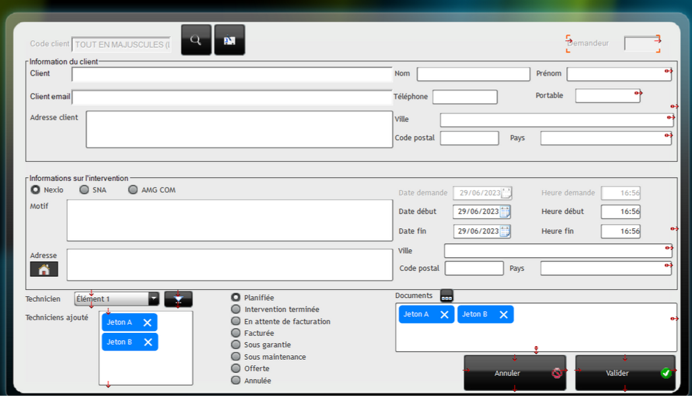

**ExDevTech** is a mobile and desktop application developed during my work-study year to modernize the workflow of field technicians.  
Previously relying on paper forms the company needed a digital solution to create, assign and manage intervention reports more efficiently.

I designed and implemented the entire system from scratch including a **Flutter mobile app** for technicians, a **Python Flask REST API** for data exchange, and a **Windev CMS extension** for the office secretary to create and send interventions.  
The mobile app allows technicians to view their schedules, access client information, complete digital forms with photos and signatures and even work **offline** when no network is available.

As the **sole developer**, I handled the full development cycle from user research and UI mockups to backend design and deployment while maintaining constant communication with end users to ensure the tool fit their daily workflow.  
The project was well received and remains in production today, one year after deployment, still used actively without major issues.

Link: <a href="#">Internal Production Project</a>

