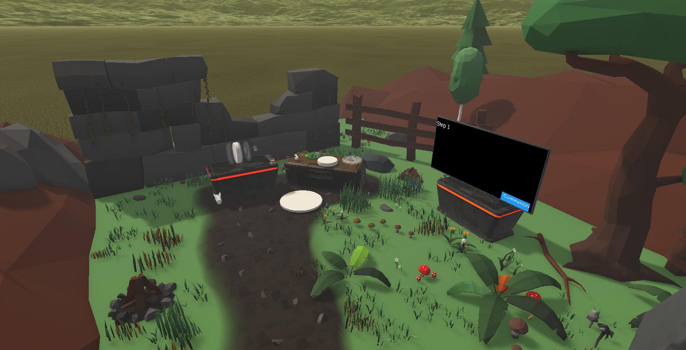
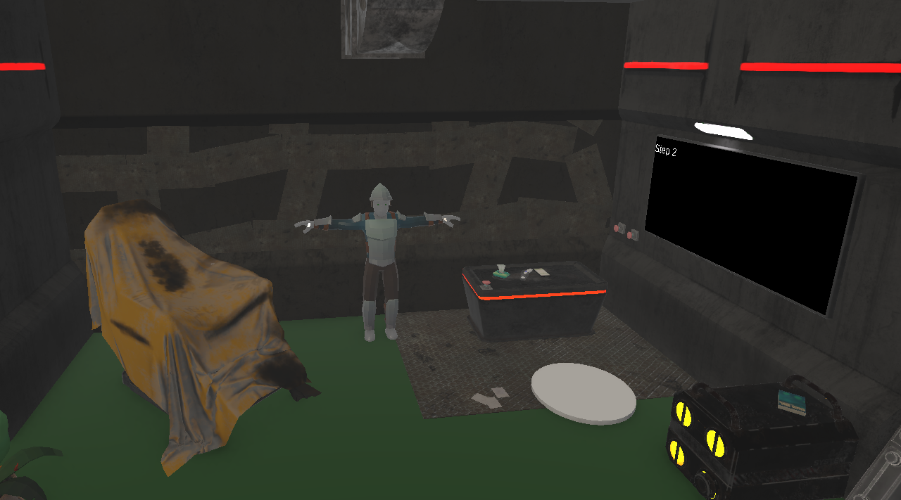

**Glycémie VR** is a virtual reality serious game developed for INSA Toulouse to help students learn about the use of blood glucose monitors in a more engaging and interactive way.  
Developed over four weeks by a team of four as part of a university project, the experience was designed for Meta Quest using Unity VR.

As **project manager and game designer**, I was responsible for writing the complete game design document, coordinating the team through Trello and weekly meetings, and researching how to make the topic of glycemia more pedagogical and playful.  
I also developed the **text-to-speech system**, improving immersion by replacing on-screen text with spoken explanations, and contributed to the **quiz gameplay** implementation.

Throughout the project, I learned how to transform complex scientific concepts into accessible gameplay, balance VR comfort for a general audience, and manage a small interdisciplinary team under tight deadlines.  
The project was well received by both the client and the academic jury.

Link: <a href="https://youtu.be/dnQE1dS31Kw">Glycémie VR Demo</a>

